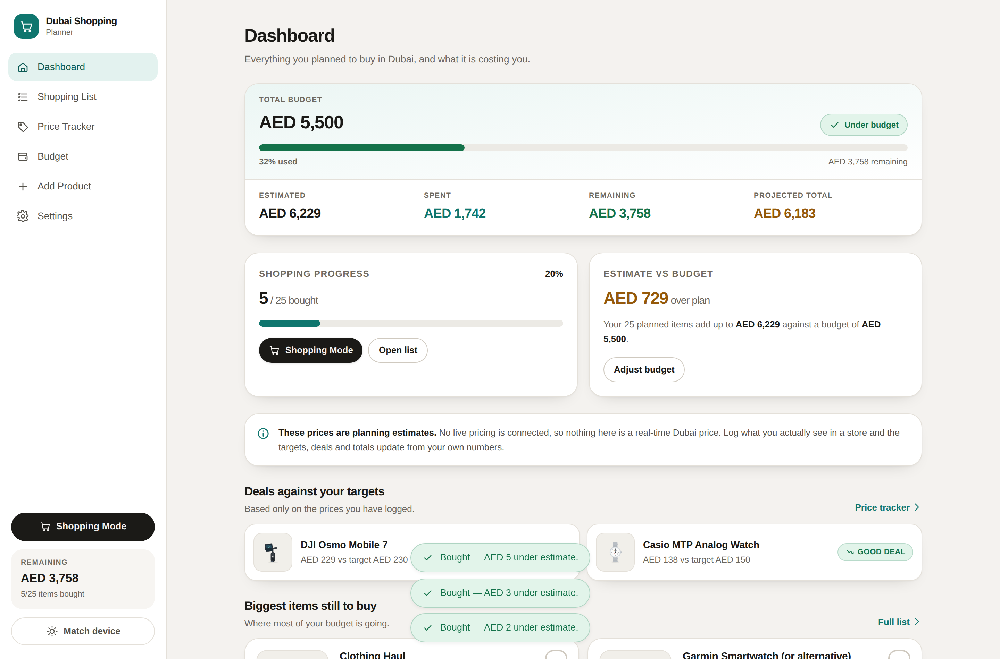

# Shopping List

A personal shopping planner: a checklist of everything you plan to buy, what you
expect it to cost, what you actually paid, and how much budget is left. Built to
be used one-handed on a phone while standing in a shop.

Prices can be in any of the world's currencies, and totals are converted into
whichever one you pick.

It installs to your home screen and **works with no signal at all** — useful in a
mall basement. Everything is stored on your own device; nothing is uploaded.



## What it does

- **Dashboard** — total budget, estimated total, spent, remaining, percentage
  used, completion, deals found and spending per category. Every figure is
  derived from the product list; nothing is hard-coded into the UI.
- **Shopping list** — one card per product with image, target price, current
  observed price, price paid, deal verdict, store, notes and a mini price chart.
  Search, five status filters, category filter and nine sort orders.
- **Price tracker** — target / current / lowest / highest / last checked per
  product, a price-history chart, and a per-store comparison table that
  highlights the cheapest sighting.
- **Budget limiter** — drag the limit itself, with the plan and your spend marked
  on the same scale, plus a second slider for how early it warns you (the
  warning point used to be fixed at 80%). Quick presets and a custom amount are
  still there. Going over never blocks anything — it only changes what the app
  tells you.
- **Add product** — name, price and quantity required; image upload, category,
  brand, store, target price, link and notes optional. Custom products behave
  exactly like preloaded ones.
- **Shopping Mode** — a stripped-back full-screen view for use inside a store:
  image, name, target, best price, store, notes and a large checkbox.
- **Currency** — pick any ISO currency for your budget and totals, price
  individual items in whatever currency you saw them in, and let the app convert.
  Exchange rates refresh from a live source in the background.
- **Settings** — appearance, JSON export/import, reset to the starter plan.
- **Dark mode** — a switch on the dashboard, plus a three-way choice (system /
  light / dark) in Settings. The switch shows what you are actually looking at,
  so while the device is still in charge it is marked "Auto".
- **Spending chart** — cumulative spend per day against the budget ceiling, with
  a crosshair that scrubs the headline figure, keyboard stepping, and a table
  view showing the same numbers.

### About the prices and rates

Every preloaded figure is a **planning estimate**. No live *pricing* API is
connected and the app never implies otherwise: a product has no "current price"
until you log one yourself, and deal labels are calculated only from prices you
recorded.

Exchange rates are the one thing that is fetched, because a rate is a fact about
the world rather than a claim about a shop. They are stamped with their source
and the time they were fetched, cached for offline use, and can be overridden by
hand. When no rate exists for a currency, the affected items are **excluded from
the totals and named on screen** rather than counted at the wrong value.

Bundled product artwork is hand-drawn illustration shipped with the app, marked
as such in the UI, and never presented as a photo of a specific item for sale.
Upload your own photo on any product to replace it.

## Getting it onto your phone

The planner is a progressive web app, so "installing" means adding it to your
home screen. It then opens full screen with no browser bar, and the whole app is
cached on the device so it runs with the network off.

**Installing needs an `https` address** (or `localhost`) — that is a browser rule
for offline caching, not a choice this app makes. There are two practical routes.

### Option A — the published site (recommended, fully offline)

It is already live:

**<https://jomisir.github.io/purchase-list/>**

Open that on your phone and follow the steps in **Settings → Install on your
phone**. Nothing to set up.

`.github/workflows/deploy.yml` rebuilds and republishes on every push to the
default branch (running the tests first), so the address always serves the
current code. It publishes by force-pushing the built output to the `gh-pages`
branch — that branch is generated, never edit it by hand.

After the first load the app is cached. Turn off mobile data and it still opens,
still shows your list, and still records prices and purchases.

### Option B — from your own computer over Wi-Fi (no offline caching)

```bash
npm run build
npm run preview:lan     # prints a Network address like http://192.168.1.20:4173/
```

Open that address on a phone connected to the same Wi-Fi. On iPhone you can
still **Share → Add to Home Screen** and get the full-screen app. Because a LAN
address is plain `http`, the browser will not let it cache itself, so it only
works while your computer is serving it and you are on that network. The app
says so in Settings rather than pretending otherwise.

### What "installed" gets you

- Full-screen launch from the home screen, with its own icon and name.
- Works offline — including logging prices and checking items off.
- Long-press the icon for shortcuts straight into Shopping Mode, Add Product or
  the Price Tracker.
- Your data lives in this device's browser storage. It is not synced anywhere, so
  use **Settings → Export JSON** before clearing browser data or changing phone.
- When a newer version is published, the app fetches it in the background and
  offers a **Reload** button rather than interrupting you mid-shop.

## Running it

```bash
npm install
npm run dev          # development server
npm run dev:lan      # same, reachable from a phone on your Wi-Fi
npm run build        # typecheck + production build into dist/
npm run preview      # serve the production build
npm run preview:lan  # serve it to your Wi-Fi network
npm test             # unit tests
```

The build is fully static (relative asset paths, hash routing), so `dist/` can be
served from any host or sub-path — verified end to end under a `/purchase-list/`
prefix, service worker and manifest included.

## Architecture

```
src/
  types/          domain model (Product, PriceRecord, Settings, AppData)
  data/seed.ts    the preloaded catalogue — pure data, no UI
  lib/
    pwa.ts        service-worker registration, updates, install prompt
    calc.ts       all money/deal/stat maths as pure functions
    currency.ts   the ISO currency list, derived from the runtime's own data
    rates.ts      fetching, caching and applying exchange rates
    money.ts      formatting and price parsing
    transfer.ts   import/export + defensive normalisation of stored data
    url.ts        product-link validation
    image.ts      upload handling: downscale, re-encode, preview
    storage/      persistence adapters behind one async interface
  context/        reducer + provider; the only place state changes
  components/     presentation
  pages/          one file per route
build/
  serviceWorkerPlugin.ts   emits sw.js with this build's real asset names
public/
  manifest.webmanifest     app name, icons, shortcuts, standalone display
  icons/                   192/512 any + maskable, plus an apple-touch-icon
```

Three rules hold the structure together:

1. **Data is never embedded in components.** Products come from `data/seed.ts`,
   flow through the reducer, and reach the UI as props.
2. **All arithmetic lives in `lib/calc.ts`** as pure functions, so budget totals,
   deal detection and price statistics are unit-tested without rendering.
3. **Persistence is an interface.** `lib/storage` exposes an async
   `PersistenceAdapter` (`load` / `save` / `clear`). IndexedDB is the default,
   localStorage the fallback, in-memory the last resort.

### Currencies and exchange rates

The currency list is not a hand-maintained table — it comes from
`Intl.supportedValuesOf('currency')`, with names, symbols and minor units read
from `Intl` too. That keeps it complete and correct: yen has no decimal places,
Kuwaiti dinar has three, and formatting follows each currency's own conventions.

Rates are fetched from two free, keyless providers that are **raced against each
other**, so a refresh takes as long as the quicker one rather than the slower:

| Provider | Why |
| --- | --- |
| `cdn.jsdelivr.net` (currency-api) | A static file on a global CDN — usually the fastest |
| `open.er-api.com` | Independent fallback with broad coverage |

Refreshes happen in the background on launch when the stored rates are more than
12 hours old, never blocking the first screen, and are skipped entirely when the
browser reports it is offline. A manual **Refresh now** button reports how long
it actually took.

`convert()` returns `null` rather than a guess when a rate is missing, and every
caller is written to say so.

### Adding a real price API later

`Product.currentPrice` and `Product.priceHistory` are the only things a price
source would write. A fetcher would dispatch `addPriceRecord` with
`source: 'api'` and every screen updates — no component changes. Manual price
tracking keeps working with or without it.

### How the offline caching works

`build/serviceWorkerPlugin.ts` runs at build time and writes `dist/sw.js`
containing the exact hashed filenames this build produced, plus a cache name
derived from them. The worker precaches that list on install, serves navigations
from the cached shell, and deletes older caches when it activates. A new build
produces a new cache name, so an update is atomic: the old version keeps working
until you press **Reload**.

Every path is resolved against the worker's own scope, which is why the same
build runs unchanged from `/`, from a LAN address, or from a
`/purchase-list/` sub-path.

### Swapping in Supabase

Implement `PersistenceAdapter` against Supabase and return it from
`createPersistence()` in `src/lib/storage/index.ts`. The interface is already
async and the state shape (`AppData`) maps directly to `products`,
`price_records` and `settings` tables.

## Testing

`npm test` runs 125 unit tests covering budget totals, deal thresholds, price
statistics, store comparison, search/sort/filter, every reducer action, the
import/export round trip, URL validation, currency formatting and rounding,
rate conversion and re-basing, provider racing and failure, the cumulative
spending series (gap filling, conversion, quantity, missing timestamps), and the
integrity of the seed catalogue (no duplicates, one smartwatch, targets inside their stated
ranges, and an estimated total that adds up to the products themselves).

The UI was additionally driven end-to-end with Playwright across the acceptance
checklist — purchases, price logging, image upload, edit/delete, persistence
across reloads, import/export, over-budget states, Shopping Mode, keyboard
navigation, a 320px-wide viewport and a WCAG AA contrast sweep of every screen in
both themes.

The installable behaviour was verified the same way: manifest and every icon
resolve, the service worker registers and takes control, the precache fills, and
with the network switched fully off the app still cold-starts, renders all 25
products with their artwork, and records a new price. The iOS path was checked
under an iPhone user agent to confirm it shows Share-sheet instructions instead
of a button that would do nothing.

## The spending chart

One series (cumulative spend) plus one threshold (the budget), which is what the
data's job asks for: change-over-time with a target. Specifics worth knowing:

- **The budget is the ceiling.** When the budget is the larger number it becomes
  the top of the y-scale exactly, so the threshold sits on the top gridline and
  the data uses the full plot height rather than being squashed under a
  rounded-up axis.
- **Quiet days are drawn.** Days with no purchase are filled in, so a flat
  stretch means "bought nothing that day" rather than the axis silently
  compressing time.
- **The readout replaces a floating tooltip.** Hovering or arrowing scrubs the
  headline number and its caption instead of covering the plot — so the value is
  readable without hovering at all, and nothing occludes the budget label.
- **Identity does not rest on hue.** The budget line is dashed and directly
  labelled; the spend line is solid with an end marker. They stay distinct in
  greyscale, under colour-vision deficiency, and in forced-colors.
- **A table view is the twin.** Same days, same running totals, plus what was
  bought each day.

On colour: the chart uses the app's own brand teal and gold tokens. Run through
the dataviz validator, the checks that decide whether two marks can be told apart
pass comfortably in both themes — CVD separation ΔE 11.7 light / 10.4 dark
against a target of 8, normal-vision ΔE 19, contrast ≥3:1. Two structural checks
calibrated for multi-series categorical palettes do fail (the light teal's chroma
sits at 0.086 against a 0.10 floor; the dark steps sit above the dark lightness
band), and every on-brand teal fails them the same way — passing would mean
leaving the brand hue for a blue. The secondary encoding above is the remedy the
validator itself prescribes.

## A note on the name

The app is called **Shopping List**, but a few internal identifiers still read
`dubai-shopping-planner`: the localStorage key, the IndexedDB database name, the
service-worker cache prefix, and the manifest `id`. That is deliberate. Those
strings are identity, not labels — renaming them would orphan the data already
saved on people's phones and make browsers treat the app as a brand new install.
See `public/README-manifest.md`.

## Phone behaviour

- Bottom tab bar with a centre action button; sticky chrome respects the status
  bar and home-indicator safe areas when launched from the home screen.
- Inputs are 16px on small screens so iOS does not zoom on focus.
- Usable down to 320px wide with no horizontal scrolling.
- Touch targets are at least 36px, and Shopping Mode's checkboxes are 44px.
- Product artwork is bundled SVG, so the whole catalogue renders offline.
- The browser chrome (iOS status bar, Android address bar) is recoloured to match
  the active theme.

## Accessibility

Text meets WCAG AA contrast on every screen in both light and dark themes
(audited programmatically). Budget and deal status is always carried by a word
and an icon, never colour alone. Checkboxes are real inputs with labels, dialogs
trap focus and close on Escape, images carry alt text describing whether they are
an illustration, and controls are at least 36px on touch.
